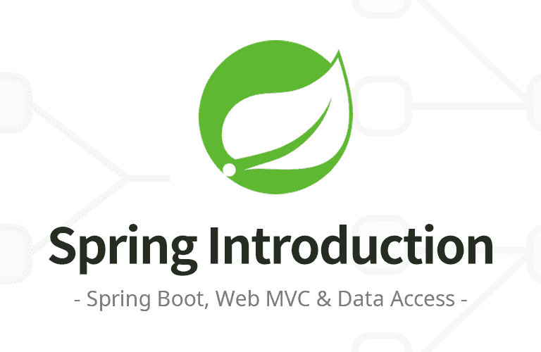

  
  <h1>Spring Introduction</h1>
  

    
    
    
  

---

## 🚩 목표

- 스프링 프레임워크가 무엇인지 이해합니다.
- 스프링을 공부하는 방법을 배웁니다.
- 스프링으로 웹 애플리케이션을 만드는 방법을 이해합니다.

## 📝 목차

<strong>목차 살펴보기</strong>

### 섹션 0. 강의 소개

- [x] 강의 소개
- [x] 강의 자료

### 섹션 1. 프로젝트 환경설정

- [x] 프로젝트 생성
- [x] 라이브러리 살펴보기
- [x] View 환경설정
- [x] 빌드하고 실행하기

### 섹션 2. 스프링 웹 개발 기초

- [x] 정적 컨텐츠
- [x] MVC와 템플릿 엔진
- [x] API

### 섹션 3. 회원 관리 예제 - 백엔드 개발

- [x] 비즈니스 요구사항 정리
- [x] 회원 도메인과 리포지토리 만들기
- [x] 회원 리포지토리 테스트 케이스 작성
- [x] 회원 서비스 개발
- [x] 회원 서비스 테스트

### 섹션 4. 스프링 빈과 의존관계

- [x] 컴포넌트 스캔과 자동 의존관계 설정
- [x] 자바 코드로 직접 스프링 빈 등록하기

### 섹션 5. 회원 관리 예제 - 웹 MVC 개발

- [x] 회원 웹 기능 - 홈 화면 추가
- [x] 회원 웹 기능 - 등록
- [x] 회원 웹 기능 - 조회

### 섹션 6. 스프링 DB 접근 기술

- [x] H2 데이터베이스 설치
- [x] 순수 JDBC
- [x] 스프링 통합 테스트
- [x] 스프링 JdbcTemplate
- [x] JPA
- [x] 스프링 데이터 JPA

### 섹션 7. AOP

- [x] AOP가 필요한 상황
- [x] AOP 적용

### 섹션 8. 다음으로

- [x] 다음으로

## 💬 후기

> <i>"스프링 해야지.."만 수 백번하다 이번에 스프링을 배우게 되었다. 입문 강의라 내용이 깊진 않지만, 스프링의 핵심은 한 번씩 훑고 가서 좋았다.</i>  
> <i>진작에 공부했으면 좋았을 것 같지만, 회사에서 Flask로 API 개발하면서 뒹굴어진터라 스프링에서 제공하고 있는 기능을 볼 때마다 깜짝 놀랐다. 약간 전에 노마드코더에서 순수 바닐라 JS로 웹 개발하다 React로 개발했을 때 느낀 그 기분과 같다. 또한 객체지향 원칙도 같이 배울 수 있어서 좋다.</i>  
> <i><strong>꾸준히 해서 내년 상반기까지 [스프링 로드맵](https://www.inflearn.com/roadmaps/373)을 완전 정복하고 싶다.</strong></i>
